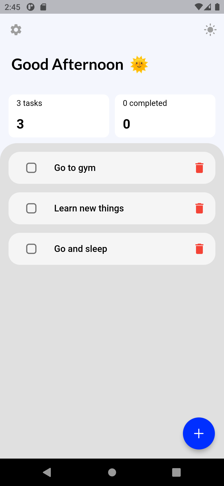
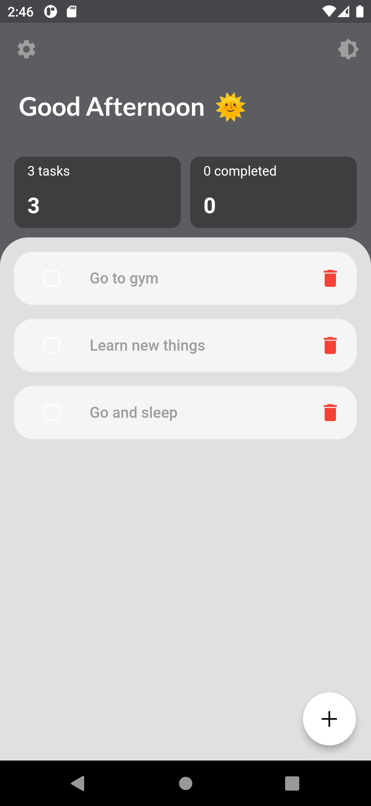
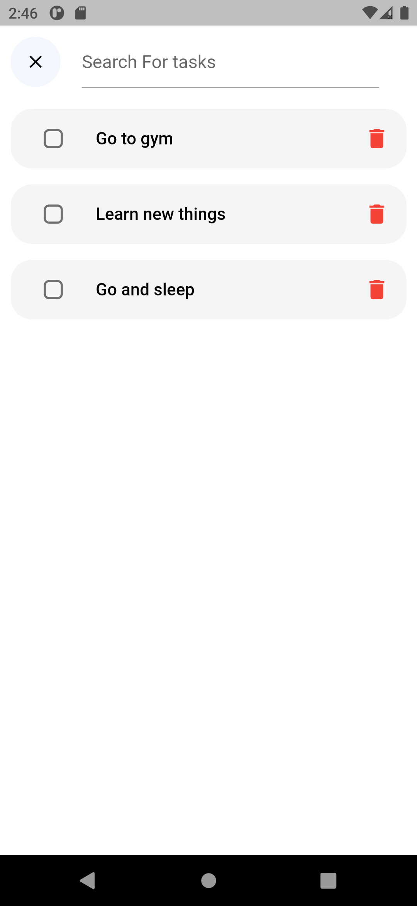
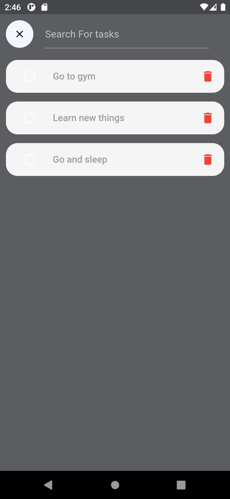
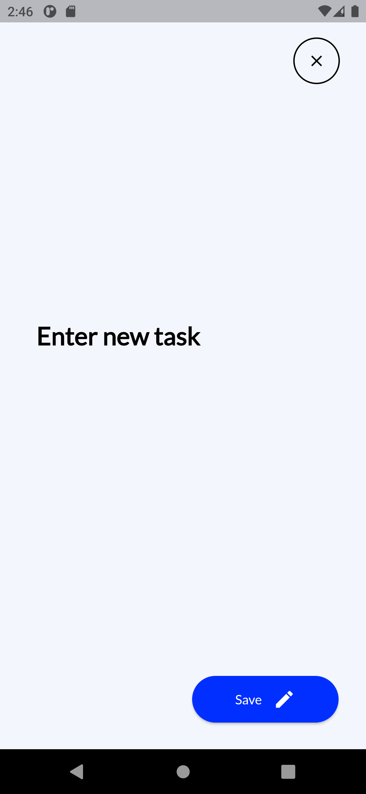
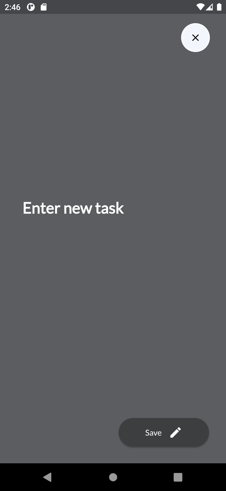
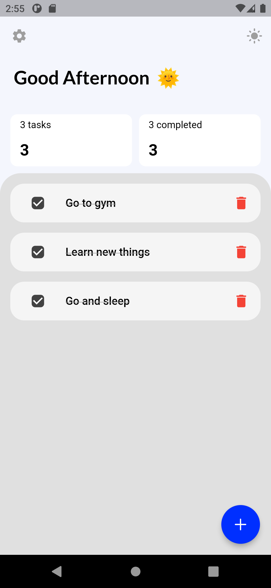
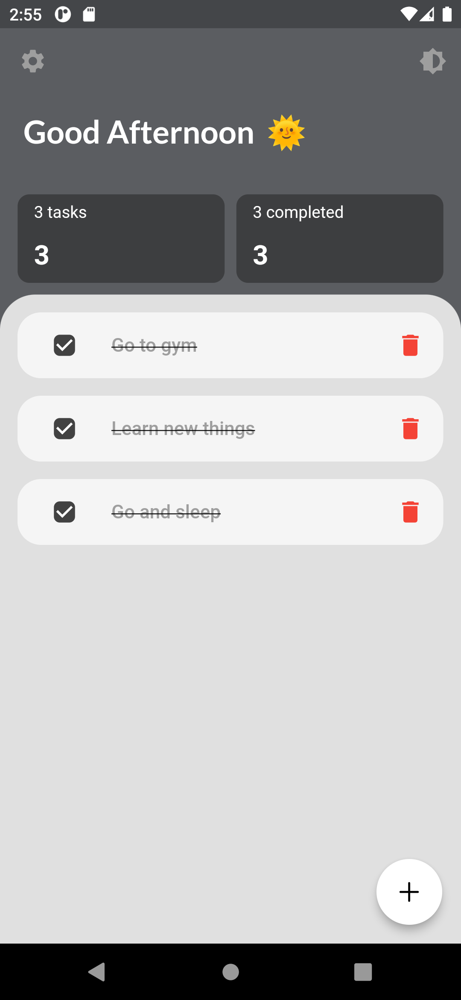
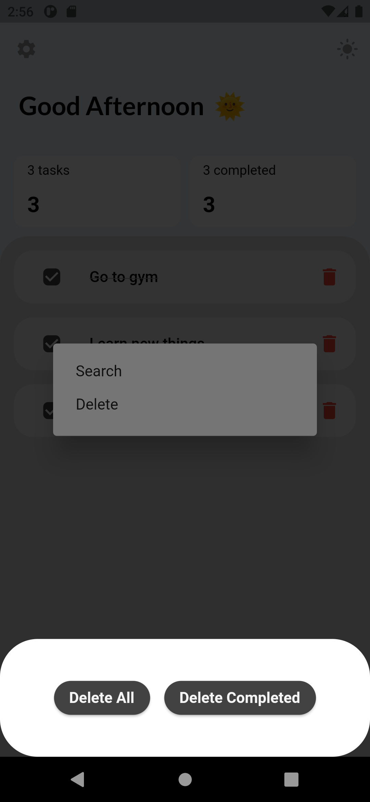

# Todo_app
 Is a basic app where by user can create a task , and also edit a task , user can change the theme of the app, using provider as state management and hive db as local database. 
 
## Features
 . Delete all completed tasks
 . Delete task according to the index
 . Light theme and dark theme
 . animation

## ScreenShots

 
 
 
 

## 🤓 Author(s)
**Micheal Olatunbosun**

